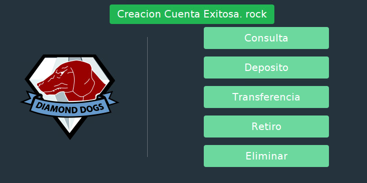
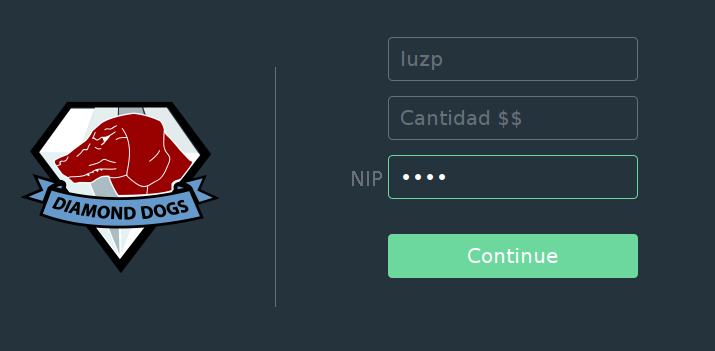
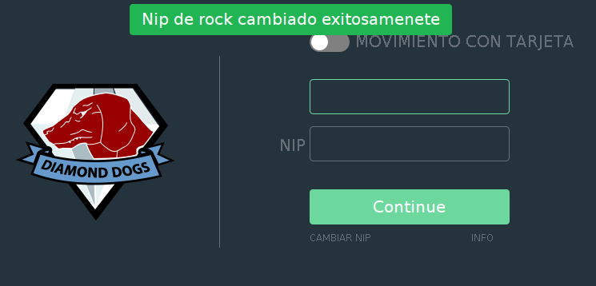

# Swing Sistema Cajero Automatico (ATM) 

## Description

Este proyecto implementa un sencillo sistema de cajero automatico, utilizando Java Swing para su implementación. El cliente se conecta con un servidor (Flask) por medio de solicitudes HTTP.

## Ejemplos:
**Login:**


**Operaciones:**


**Form:**


**Resultado:**


**Cambiar Nip:**




**Informacion:**


## Codigo de la GUI:
**Envie toasters para alertar al usuario de cierta información:**
```java
private final Toaster toaster = new Toaster(mainJPanel);

toaster.error("An error event!!", "Or multiple at once");
toaster.warn("A warning event!", "Or multiple at once");
toaster.info("An informational event.", "Or multiple at once");
toaster.success("A successful event!", "Or multiple at once");
```

**Crea tus propias Views** [`OperationsView.java`](LoginGUI/src/ClientViews/OperationsView.java)
```java
public class OperationsView extends BaseLayout {
  String responseContext;
  boolean state;

  OperationsView(Object... params) {
    super();
    manageParams(params);
    if (params.length != 0) {
      if (!this.state) {
        this.error(this.responseContext);
      } else {
        this.toaster.success(responseContext);
      }
    }
    if (User.getUser().isCardMovement()) {
      buildView();
    } else {
      buildAltView();
    }
  }

  private void buildView() {
    this
        .addC(ComponentDispenser.createLogo())
        .addC(ComponentDispenser.createSeparator(310, 80))
        .addC(ComponentDispenser.createOperationButton("Consulta", Transactions.CONSULT.name(), 423, 60))
        .addC(ComponentDispenser.createOperationButton("Deposito", Transactions.DEPOSIT.name(), 423, 119))
        .addC(ComponentDispenser.createOperationButton("Transferencia", Transactions.TRANSFER.name(), 423, 178))
        .addC(ComponentDispenser.createOperationButton("Retiro", Transactions.WITHDRAW.name(), 423, 237))
        .addC(ComponentDispenser.createOperationButton("Eliminar", Transactions.DELETE_ACCOUNT.name(), 423, 296))
        .getBtnInFrame();
  }

  private void buildAltView(){
     this
          .addC(ComponentDispenser.createLogo())
          .addC(ComponentDispenser.createSeparator(310, 80))
          .addC(ComponentDispenser.createOperationButton("Deposito", Transactions.ANOYMUS_DEPOSIT.name(), 423, 119))
          .getBtnInFrame();
  }
  
  @Override
  public void btnHandler(String operation) {
    if (operation.equals(Transactions.CONSULT.name())) {
      ViewBuilder.buildView(Views.TRANSACTION, new Consult()).display();
    } else if (operation.equals(Transactions.DEPOSIT.name())) {
      ViewBuilder.buildView(Views.TRANSACTION, new Deposit()).display();
    } else if (operation.equals(Transactions.TRANSFER.name())) {
      ViewBuilder.buildView(Views.TRANSACTION, new Transfer()).display();
    } else if (operation.equals(Transactions.WITHDRAW.name())) {
      ViewBuilder.buildView(Views.TRANSACTION, new Withdraw()).display();
    } else if (operation.equals(Transactions.DELETE_ACCOUNT.name())) {
      ViewBuilder.buildView(Views.TRANSACTION, new DeleteAccount()).display();
    }else if (operation.equals(Transactions.ANOYMUS_DEPOSIT.name())) {
      ViewBuilder.buildView(Views.TRANSACTION, new AnonymusDeposit()).display();
    }
    this.terminate();
  }

  @Override
  protected void manageParams(Object... params) {
    if (params == null)
      return;
    if (params.length == 0)
      return;
    
    for (Object param : params) {
      if (param instanceof Boolean) {
        this.state = (boolean) param;
      } else if (param instanceof String) {
        this.responseContext = (String) param;
      }
    }
  }

  private void addDeclaredComponents(Component... components) {
    for (var c : components) {
      this.add(c);
    }
  }

  public BaseLayout getView() {
    return this;
  }
}
```
Nota: Sobreescriba los metodos `btnHandler()` y `manageParams()` para dar funcionalidad a sus botones y obtener parametros en la view respectivamente. 

**Agrega la View al ViewBuilder** `LoginGUI/src/ClientViews/ViewBuilder.java`
 ```java
   else if (view.name().equalsIgnoreCase("OPERATIONS")) {
      return new OperationsView(params);
    }
```

## Codigo del Sistema:

**Cree Operaciones:** [`Deposit.java`](LoginGUI/src/System/Transactions/Deposit.java)
```java
public class Deposit implements Operation {

  public Deposit() {
  }

  public void setParameters(Object ... getparams) {
    new Transaction(this).setTransactionParameters(getparams).deposit();
  }

  public String toString(){
    return  Transactions.DEPOSIT.toString();
  }
}
```

**Añada las claves de sus transacciones:** [`Transaction.java`](LoginGUI/src/System/Transaction.java)
```java
 public void createAcount(){
    keys =  new String[] {"accountid", "nip"};
  }
  
  public void deleteAcount(){
    keys =  new String[] {"accountid", "nip"};
  }
  
  public void deposit(){
    keys = new String[] {"accountid","nip", "amount"};
  }
```
**Añada el nombre de su operación al enum general:** [`Transactions.java`](LoginGUI/src/System/Transactions/Transactions.java)
```java
public enum Transactions {
  ANOYMUS_DEPOSIT,
  CONSULT,
  NEW_ACCOUNT,
  DELETE_ACCOUNT,
  CHANGE_NIP,
  DEPOSIT,
  TRANSFER,
  WITHDRAW,
  LOGIN
}
```
## Corra una versión de prueba:
[ATMCliente](https://replit.com/@tesag/ATMClient)

## Instrucciones para implementación:
1. `git clone https://github.com/tesagEscolar/ATMClient/LoginGUI`
2. Cambie el archivo `diamond_dogs_ch.png` bajo `/resources` por su propio logo.
3. Adapte todos sus botones sobreescribiendo el metodo `btnHandler` en cada view, use la propiedad `operacion` para identificar cada botón.
4. Agregue o modifique sus operaciones agregando el metodo correspondiente en la clase `Transaction`
5. Compile con `javac -classpath .:target/dependency/* -d . $(find . -type f -name '*.java')`
6. Corra con `java -classpath .:target/dependency/* LoginGUI.src.ATMClient`


## Diagramas:
**Diagrama de flujo:**


**Diagrama de uso de caso:**


**Diagrama de clases:**

